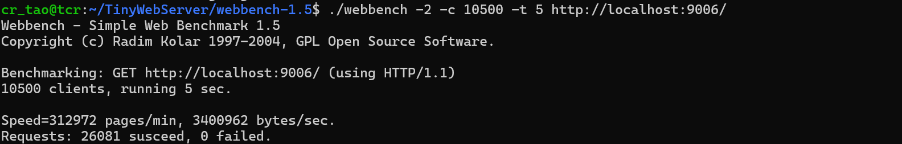

###TinyWebServer

## 一、项目简介
本项目基于C/C++实现一个TinyWebServer。旨在实现高性能的HTTP处理，同时支持定时功能和日志功能，是一个个人学习和练手的项目。

## 二、使用方式

在命令行中使用如下命令来编译得到Server可执行文件:
`g++ -g -o server main.cpp ./Timer/Timer.cpp ./http/HTTP.cpp ./log/Log.cpp ./MySql/MySql.cpp ./WebServer/WebServer.cpp ./config/config.cpp -lpthread -lmysqlclient`

使用一下命令运行服务器:
`./server -p port -s sql_number -t thread_number -r request_number`
其中:
    -p选项指定端口号
    -s选项指定数据库连接池中sql连接数量
    -t选项指定线程池中线程数
    -r选项指定请求队列中请求的最大数量

## 二、实现细节
# 1、计时器
书中介绍了三类计时器容器,分别为:
(1)基于升序链表的计时器
链表的每个元素是一个计时器,按照计时器触发时间从小到大排序。
每当触发一次超时事件时，就从表头开始遍历链表,直到第一个不超时的表元处结束。==>平均时间O(n) 
添加和删除计时器,需要遍历链表,平均时间也是O(n)

(2)时间轮
有N个槽,每个槽指向一个链表,链表的表元为计时器。属于同一个链表的计时器的出发时间t%timeslot的值相同。
每当触发一次超时事件时,只需要检查当前槽中的计时器,然后指向下一个槽。 ==>性能比O(n)要更好，n是计时器总数
添加计时器,只需要找到对应的槽,插入到表头。 ==> 复杂度O(1)
删除计时器,找到槽,遍历槽的链表 ==>复杂度优于O(n),n是计时器总数
时间轮的缺点在于:计时精度不足,把触发时间在[n*timeslot,n*timeslot+timeslot)内的计时器统一当做触发时间为n*timeslot的计时器来处理。

(3)时间堆
将容器实现为最小堆结构,按照计时器触发时间排序。
触发一次超时事件时,不断pop()堆顶元素,直到堆顶计时器当前没有超时。
添加一个timer ==>O(logn)
删除一个timer ==>O(logn)

我选择使用时间堆,因为时间堆效率上优于升序链表,同时,计时精度上优于时间轮。

# 2、线程池
一个WebServer可能同时收到多个HTTP请求,此时需要并发处理。
本项目对于并发处理,采用的是线程池技术。

一个线程池类需要的:
(1)构造函数:创建pthread_t*pool,用于保存线程的tid;创建若干个线程,并设置为脱离
(2)析构函数
(3)请求队列:保存待处理的HTTP请求
(4)锁:保护对请求队列的访问
(5)信号量:值反映请求队列中请求数
(6)append(T*request):把请求添加到请求队列
(7)void* worker(void*arg):静态成员函数,是线程要执行的函数
(8)void run():成员函数,被worker调用

由于pthread_create()要求要执行的函数必须是静态函数,且函数的签名必须是void*func(void*),所以不能将普通的成员函数传递给它。普通成员函数隐含第一个参数this指针,不是void*类型的。
这里有两种解决方式:
(1)worker实现为全局函数
(2)worker实现为类的静态成员函数
两种方式都不会有隐含this指针作为参数。

本线程池采用的是半同步/半反应堆模型:
主线程是异步线程,在监听到请求后,进行I/O,并把请求插入到请求队列中
线程池中的工作线程是同步线程,不负责I/O,只负责处理read_buffer中的请求,以及填充write_buffer.

# 3、事件处理模式
书中主要讲了三种事件处理模式:
(1)Reactor模式
主要采用同步I/O(在I/O事件{读就绪、写就绪等事件}发生之后才进行I/O操作)。通俗理解:发起请求 → 阻塞等待 → 完成操作 → 继续执行
主线程只负责监听I/O事件是否发生,发生则通知工作线程,由工作线程完成具体的I/O操作

(2)Proactor模式
主要采用异步I/O。程序采用异步I/O时,不会阻塞等待而是立即返回,内核在后台完成I/O操作后通知程序I/O操作完成。
主线程监听到I/O事件之后,自己采用异步I/O。收到内核通知的I/O完成消息后,通知工作线程处理请求。

(3)同步I/O模拟Proactor模式
主线程监听到I/O事件之后使用同步I/O完成I/O操作,然后通知工作线程处理。

我的WebServer采用了第三种方式。把I/O放到了主线程中,这样工作线程不会被阻塞，可以提高工作线程的利用率。

# 4、数据库连接
我们的WebServer支持登录注册功能,因此需要数据库保存user_name与password。
同时,可能出现多人同时登录注册,这时需要并发,采用的技术是数据库连接池。

预先建立若干条数据库连接保存于数据库连接池中,需要时从池中取出连接来使用。

# 5、日志系统
一个WebServer的日志系统应该唯一,因此任意时刻记录日志都需要用同一个日志实例。
实现方式为使用静态成员函数GetInstance()。该函数内部创建局部静态变量,该变量是日志类的一个实例,返回该实例的指针。
这样,每次写日志都通过 Log::GetInstance()->write_log() 来完成。

## 四、压力测试

首先执行以下命令安装依赖
`sudo apt-get install exuberant-ctags`

然后执行以下命令安装并编译Webbench
`wget http://blog.s135.com/soft/linux/webbench/webbench-1.5.tar.gz`  
`tar zxvf webbench-1.5.tar.gz`  
`cd webbench-1.5`  
`make && sudo make install`

如果出现下面的报错:

```shell
cc -Wall -ggdb -W -O   -c -o webbench.o webbench.c
webbench.c:21:10: fatal error: rpc/types.h: No such file or directory
   21 | #include <rpc/types.h>
      |          ^~~~~~~~~~~~~
compilation terminated.
make: *** [<builtin>: webbench.o] Error 1
```
需要运行以下命令
```shell
 sudo apt update
 sudo apt install libtirpc-dev
```
同时在Makefile中添加以下命令:
`CFLAGS += -I/usr/include/tirpc`
注:最新版本的项目中,已经Makefile中添加该命令

接下来开始测试:

(1)运行服务器
`./server`

(2)启动webbench测试
`./webbench -2 -c m -t n url`
-2指定HTTP协议版本为1.1 (我的WebServer只支持1.1版本) 
-c指定客户端数量
-t指定Webbench持续运行的时间
url是服务器地址

(3)测试结果


